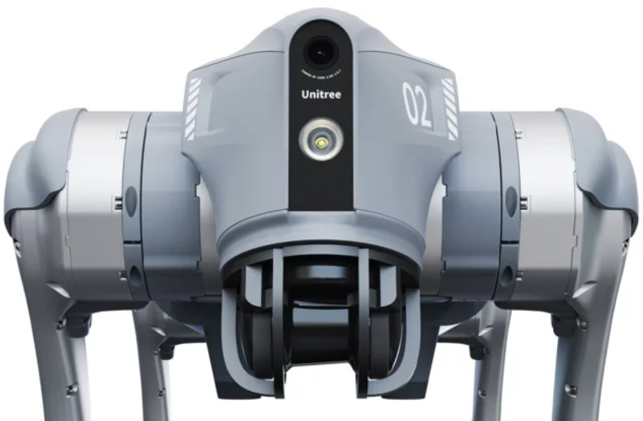
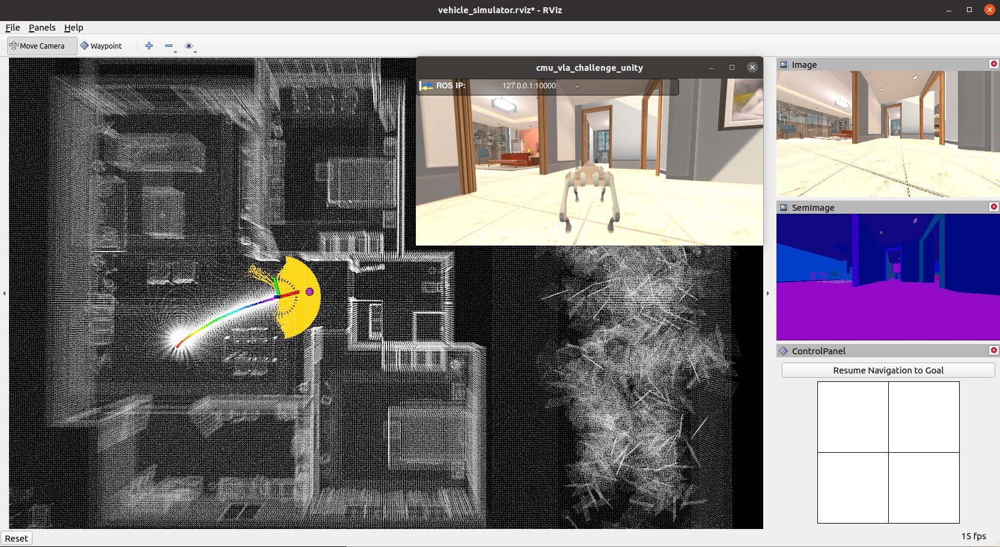
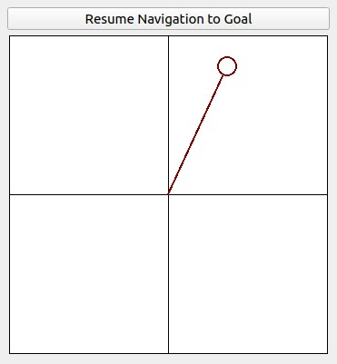
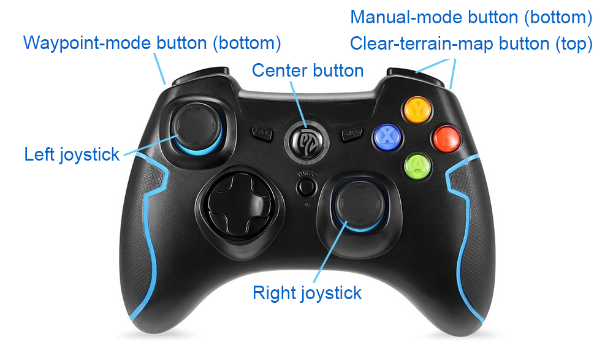
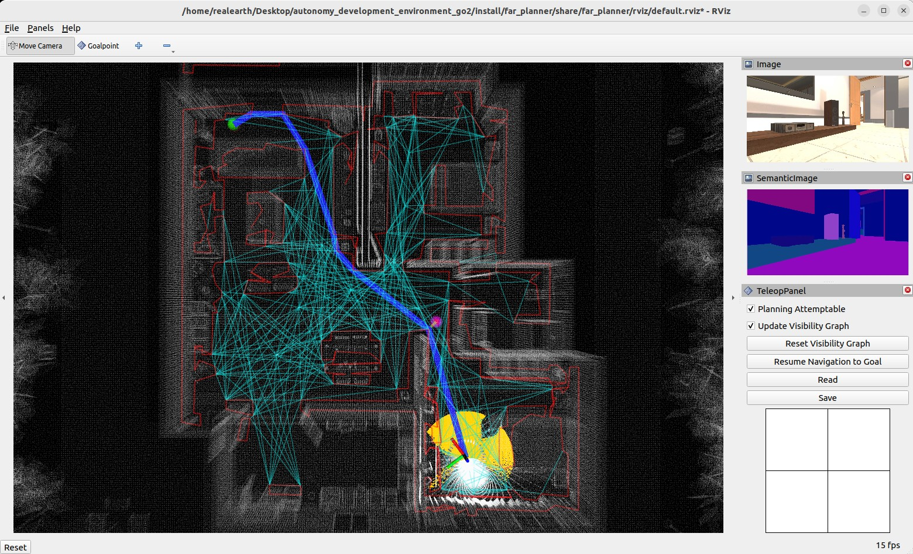
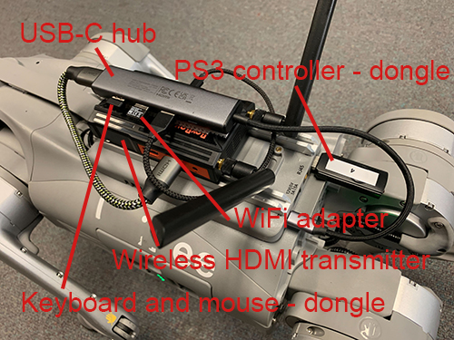
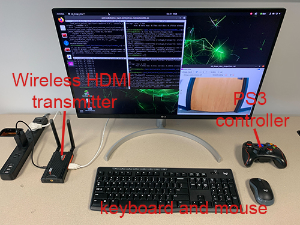
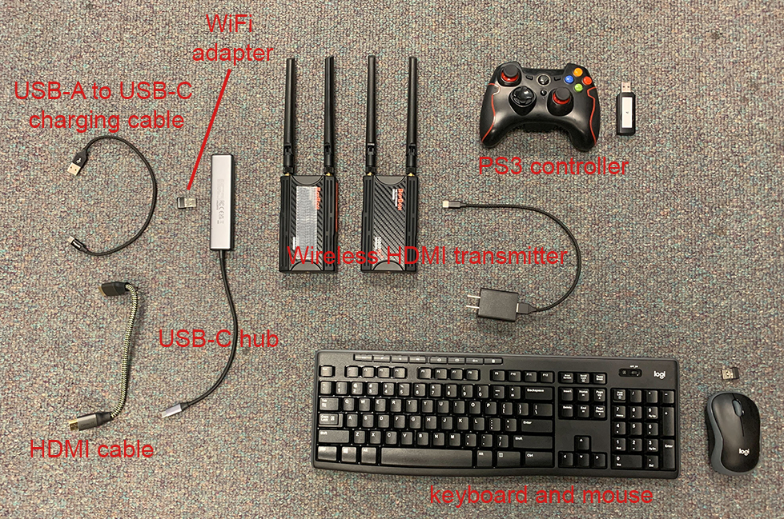
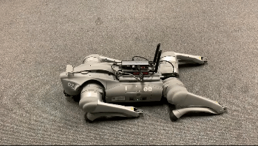

The repository contains the full autonomy stack for the [Unitree Go2 platform](https://shop.unitree.com/products/unitree-go2). The system provides a navigation capability of taking a goal point and navigating Go2 autonomously to the goal point while building a map along the way. Alternatively, the system allows users to use a joystick controller to guide the navigation while the system itself is in charge of collision avoidance. The system uses only built-in sensors on Go2 - the L1 lidar and the IMU in the lidar. The system contains a SLAM module, a route planner, and a based autonomy system, where the base autonomy system further includes fundamental navigation modules for terrain traversability analysts, collision avoidance, and waypoint following. Users can run the system on the onboard computer or an external computer connected to Go2 via an Ethernet cable. Please make sure to use the **Go2 EDU version** which has SDK support.

<p align="center">
  
</p>

## Simulation Setup

### Base Autonomy

The system is integrated with [Unity](https://unity.com) environment models. For simulation, the repository has been tested in Ubuntu 22.04 with [ROS2 Foxy](https://docs.ros.org/en/foxy/Installation.html) and Ubuntu 22.04 with [ROS2 Humble](https://docs.ros.org/en/humble/Installation.html). Install dependencies with the command lines below.

For Foxy:
```
sudo apt update
sudo apt install libusb-dev ros-foxy-perception-pcl ros-foxy-sensor-msgs-py ros-foxy-tf-transformations ros-foxy-joy ros-foxy-rmw-cyclonedds-cpp ros-foxy-rosidl-generator-dds-idl python3-colcon-common-extensions python-is-python3 
pip install transforms3d pyyaml
```
For Humble:
```
sudo apt update
sudo apt install libusb-dev ros-humble-perception-pcl ros-humble-sensor-msgs-py ros-humble-tf-transformations ros-humble-joy ros-humble-rmw-cyclonedds-cpp ros-humble-rosidl-generator-dds-idl python3-colcon-common-extensions python-is-python3 
pip install transforms3d pyyaml
```
Clone the open-source repository.
```
git clone https://github.com/jizhang-cmu/autonomy_stack_go2.git

```
In a terminal, go to the folder and compile.
```
cd autonomy_stack_go2
colcon build --symlink-install --cmake-args -DCMAKE_BUILD_TYPE=Release
```
Download a [Unity environment model for Go2](https://drive.google.com/drive/folders/11GhvA8Jz1RnRSGfiQ_MDJ4X-aNMpQPPx?usp=drive_link) and unzip to the 'src/base_autonomy/vehicle_simulator/mesh/unity' folder. The environment model files should look like below.

mesh/<br>
&nbsp;&nbsp;&nbsp;&nbsp;unity/<br>
&nbsp;&nbsp;&nbsp;&nbsp;&nbsp;&nbsp;&nbsp;&nbsp;environment/<br>
&nbsp;&nbsp;&nbsp;&nbsp;&nbsp;&nbsp;&nbsp;&nbsp;&nbsp;&nbsp;&nbsp;&nbsp;Model_Data/ (multiple files in the folder)<br>
&nbsp;&nbsp;&nbsp;&nbsp;&nbsp;&nbsp;&nbsp;&nbsp;&nbsp;&nbsp;&nbsp;&nbsp;Model.x86_64<br>
&nbsp;&nbsp;&nbsp;&nbsp;&nbsp;&nbsp;&nbsp;&nbsp;&nbsp;&nbsp;&nbsp;&nbsp;UnityPlayer.so<br>
&nbsp;&nbsp;&nbsp;&nbsp;&nbsp;&nbsp;&nbsp;&nbsp;&nbsp;&nbsp;&nbsp;&nbsp;AssetList.csv (generated at runtime)<br>
&nbsp;&nbsp;&nbsp;&nbsp;&nbsp;&nbsp;&nbsp;&nbsp;&nbsp;&nbsp;&nbsp;&nbsp;Dimensions.csv<br>
&nbsp;&nbsp;&nbsp;&nbsp;&nbsp;&nbsp;&nbsp;&nbsp;&nbsp;&nbsp;&nbsp;&nbsp;Categories.csv<br>
&nbsp;&nbsp;&nbsp;&nbsp;&nbsp;&nbsp;&nbsp;&nbsp;map.ply<br>
&nbsp;&nbsp;&nbsp;&nbsp;&nbsp;&nbsp;&nbsp;&nbsp;object_list.txt<br>
&nbsp;&nbsp;&nbsp;&nbsp;&nbsp;&nbsp;&nbsp;&nbsp;traversable_area.ply<br>
&nbsp;&nbsp;&nbsp;&nbsp;&nbsp;&nbsp;&nbsp;&nbsp;map.jpg<br>
&nbsp;&nbsp;&nbsp;&nbsp;&nbsp;&nbsp;&nbsp;&nbsp;render.jpg<br>

In a terminal, go to the repository folder and launch the system.
```
./system_simulation.sh
```
After seeing data showing up in RVIZ, users can use the 'Waypoint' button to set waypoints and navigate the vehicle around. Note that the waypoints are meant to be relatively close to the vehicle. Setting the waypoint too far can cause the vehicle to get stuck at a dead end. Users can also operate in *smart joystick mode* where the vehicle tries to follow joystick commands and also avoid collisions. To do this, users can use the control panel in RVIZ or a PS3/4 or Xbox controller with a USB or Bluetooth interface. When using the controller, users can also operate in *manual mode* without any collision avoidance. Detailed information about the operations in the three modes is below.

<p align="center">
  
</p>

- *Smart joystick mode (default)*: The vehicle tries to follow joystick commands and also avoid collisions. Use the control panel in RVIZ or the right joystick on the controller to set the speed and yaw rate. If the system is in another mode, doing so will switch the system to *smart joystick mode*.

- *Waypoint mode*: The vehicle tries to follow waypoints and also avoid collisions. Use the 'Waypoint' button in RVIZ to set a waypoint by first clicking the button and then clicking where the waypoint is to be set around the vehicle. If the system is in another mode, clicking the 'Resume Navigation to Goal' button in RVIZ switches the system to *waypoint mode*. Or, users can hold the 'waypoint-mode' button on the controller and use the right joystick to set the speed. If only holding the 'waypoint-mode' button, the system will use the speed sent in ROS messages.

- *Manual mode*: The vehicle tries to follow joystick commands without any collision avoidance. Pressing the 'manual-mode' button on the controller switches the system to *manual mode*. Then, use the right joystick to set the forward and lateral speed and the left joystick to set the yaw rate, in the Mode 2 convention.

<p align="center">
  
  &nbsp;&nbsp;&nbsp;&nbsp;
  
</p>

Alternatively, users can run a ROS node to send a series of waypoints. In another terminal, go to the folder and source the ROS workspace, then run the ROS node with the command lines below. The ROS node sends navigation boundary and speed as well. Click the 'Resume Navigation to Goal' button in RVIZ, and the vehicle will navigate inside the boundary following the waypoints. More information about the base autonomy system is available on the [Autonomous Exploration Development Environment](https://www.cmu-exploration.com) website.
```
source install/setup.sh
ros2 launch waypoint_example waypoint_example.launch
```

### Route Planner

To launch the system with route planner, use the command line below.
```
./system_simulation_with_route_planner.sh
```
Users can send a goal point with the 'Goalpoint' button in RVIZ. The vehicle will navigate to the goal and build a visibility graph (in cyan) along the way. Areas covered by the visibility graph become free space. When navigating in free space, the planner uses the built visibility graph, and when navigating in unknown space, the planner attempts to discover a way to the goal. By pressing the 'Reset Visibility Graph' button, the planner will reinitialize the visibility graph. By unchecking the 'Planning Attemptable' checkbox, the planner will first try to find a path through the free space. The path will show in green. If such a path does not exist, the planner will consider unknown space together. The path will show in blue. By unchecking the 'Update Visibility Graph' checkbox, the planner will stop updating the visibility graph. When navigating with the route planner, the base system operates in *waypoint mode*. Users can click in the black box on the control panel to switch to *smart joystick mode*, or press the buttons on a joystick controller to switch to *smart joystick mode* or *manual mode*. To resume route planner navigation, click the 'Resume Navigation to Goal' button in RVIZ or use the 'Goalpoint' button to set a new goalpoint. More information about the route planner is available on the [FAR Planner website](https://github.com/MichaelFYang/far_planner).

<p align="center">
  
</p>

## Real-robot Setup

### Hardware

We set up a quick and easy communication module on Go2 with a wireless HDMI transmitter and a pair of wireless keyboard and mouse. The communication module is attached to the back of Go2 and plugged into the onboard computer at the USB-C port. The signals are transmitted to a control station with a monitor. This setup allows us to work with Go2 similar to a desktop computer - the computer walks around in the environment and communicates with the control station wirelessly. Please see the images below for detailed information about the hardware setup.

<p align="center">
  
  &nbsp;&nbsp;&nbsp;&nbsp;
  
</p>

<p align="center">
  
</p>

Below is a list of the hardware items with an overall price of about $300 (not including Go2 itself or the monitor).

- [Wireless HDMI transmitter](https://www.amazon.com/Wireless-Transmitter-Receiver-Streaming-Projector/dp/B09XQ65XWV)<br>
- [USB-C hub](https://www.amazon.com/gp/product/B0BR3M8XHK) <br>
- [PS3 controller](https://www.amazon.com/Wireless-PC-Controller-Joystick-Nintendo-Dual-Vibration/dp/B0B2R14VJB) <br>
- [WiFi adapter](https://www.amazon.com/dp/B00762YNMG) <br>
- [Wireless keyboard and mouse](https://www.amazon.com/dp/B079JLY5M5) <br>
- [USB-A to USB-C charging cable](https://www.amazon.com/dp/B08933P982) <br>
- [HDMI cable](https://www.amazon.com/dp/B08B36C6T6) <br>
- [Dual lock tape](https://www.amazon.com/Industrial-Reclosable-Boats-Cars-Drones-Indoor-Outdoor-Waterproof/dp/B09FYBZ4Z1) (For attaching the wireless HDMI transmitter and USB-C hub on Go2)

### System Setup

#### 1) On Onboard Computer

The onboard computer is pre-installed with Ubuntu 20.04 and ROS2 Foxy. Install dependencies using the command lines below.
```
sudo apt update
sudo apt install libusb-dev ros-foxy-perception-pcl ros-foxy-sensor-msgs-py ros-foxy-tf-transformations ros-foxy-joy ros-foxy-rmw-cyclonedds-cpp ros-foxy-rosidl-generator-dds-idl
pip install transforms3d pyyaml
```
Clone the open-source repository.
```
git clone https://github.com/jizhang-cmu/autonomy_stack_go2.git

```
In a terminal, go to the folder and compile.
```
cd autonomy_stack_go2
colcon build --symlink-install --cmake-args -DCMAKE_BUILD_TYPE=Release
```

#### 2) On External Computer

If using an external computer to run the system, it's recommended the computer runs Ubuntu 20.04 with ROS2 Foxy. Install dependencies and [follow instructions on the Unitree website]((https://support.unitree.com/home/en/developer/ROS2_service)) to set up DDS with cyclonedds. Note that the ROS2 environment **should not be sourced** when compiling cyclonedds.
```
sudo apt update
sudo apt install libusb-dev ros-foxy-perception-pcl ros-foxy-sensor-msgs-py ros-foxy-tf-transformations ros-foxy-joy ros-foxy-rmw-cyclonedds-cpp ros-foxy-rosidl-generator-dds-idl python3-colcon-common-extensions python-is-python3 gstreamer1.0-plugins-bad gstreamer1.0-libav
pip install transforms3d pyyaml
```
Connect the external computer to the Ethernet port pointing backward on Go2. Set the computer IP to 192.168.123.100, with netmask 255.255.255.0 and gateway 192.168.123.1 (tested and recommended). Then, **source the 'unitree_ros2_setup.sh' script** as mentioned in the Unitree instructions and use `ros2 topic list` to check if the DDS setup is correct. Note that the same script needs to be sourced in the terminal that launches the IMU calibration and the system in sections below. Next, clone and compile the repository in the same way as the onboard computer. Make sure the DDS setup is complete before compiling.

### IMU Calibration

The IMU inside the L1 lidar needs to be calibrated. This needs to be done once on every Go2. Power on Go2 and let it stand up. In a terminal, go to the repository folder and use the command lines below to source the ROS workspace and launch calibration. Let Go2 step for 2 seconds, stand for 10 seconds, and then spin for 20 seconds. After completion of the calibration, the result is saved to an 'imu_calib_data.yaml' file on the desktop. The file will be loaded into the system at the system startup. Please do not change the file name or directory. If using an external computer, **source the 'unitree_ros2_setup.sh' script** first as mentioned in the Unitree instructions. 
```
source install/setup.bash
ros2 run calibrate_imu calibrate_imu
```

<p align="center">
  
  &nbsp;&nbsp;&nbsp;&nbsp;
  
</p>

### System Usage

In a terminal, go to the repository folder and use the command line below to launch the system. This launches the SLAM module and the base autonomy system. If using an external computer, **source the 'unitree_ros2_setup.sh' script** first as mentioned in the Unitree instructions.
```
./system_real_robot.sh
```
To launch the system with route planner, use the command line below instead.
```
./system_real_robot_with_route_planner.sh
```
Users can follow the same operations as in the simulation setup to navigate Go2 in the environment. Please refer to the Simulation Setup section for operating the system in the *smart joystick mode*, *waypoint mode*, and *manual mode*. To launch the camera driver, in a separate terminal, go to the repository folder and use the command lines below. The camera driver takes an H.264 video stream and publishes images on the '/camera/image/raw' topic.
```
source install/setup.bash
ros2 run go2_h264_repub go2_h264_repub
```
To record the lidar and IMU data to a bagfile, use the command line below in another terminal while the system is running.
```
ros2 bag record /utlidar/cloud /utlidar/imu
```
Users can copy the bagfile to an external computer. Please copy the 'imu_calib_data.yaml' file as well and put it on the external computer desktop. [Example bagfile and 'imu_calib_data.yaml' file](https://drive.google.com/drive/folders/11GhvA8Jz1RnRSGfiQ_MDJ4X-aNMpQPPx?usp=drive_link) are provided. Launch the system with the same command lines above. In another terminal, play the bagfile. Note that the computer **should not connect to Go2** via Ethernet or the onboard sensor data may come in.
```
ros2 bag play bagfile_name.db3
```

<p align="center">
  
</p>

## Notes

- The onboard computer is installed with Ubuntu 20.04. The password is ‘123’. After logging into the onboard computer, open a terminal, and you are asked to choose between ROS1 Noetic and ROS2 Foxy. Press ‘1’ to choose ROS2 Foxy to use the system.

- It happens that after powering on, the clock on the onboard computer is reset to 1970, causing issues with the system. Connecting the onboard computer to WiFi automatically updates the clock.

- The default IP of the Ethernet port pointing backward is 192.168.123.18, with netmask 255.255.255.0 and gateway 192.168.123.1. Changing the IP may interrupt the communication to the platform. Please keep it.

- When running the system on an external computer with Ubuntu 22.04 with ROS2 Humble, we experience large data delay (> 1s).

- When running the system on the onboard computer or an external computer with Ubuntu 20.04 and ROS2 Foxy, We occasionally observe data delay at the system startup. The delay lasts for 10-20s. A quick way to check the delay is using the joystick controller to change the Go2 heading while also checking the vehicle coordinate frame in RVIZ. The delay can be obvious (> 1s). Please wait for the delay to fade away before navigating Go2.

- The L1 lidar is a low-cost lidar with relatively high noise. With this lidar, the terrain reversibility analysis cannot distinguish low obstacles. Please make sure all obstacles in the environments are high enough above the ground (> 0.3m).

- Occasionally, we observe SLAM drift which can cause issues with the terrain map and collision avoidance. Symptoms are Go2 getting stuck or moving in strange directions and not following waypoints. Users can press the 'clear-terrain-map button' on the joystick controller to reset the terrain map.

- The timestamps in the images are not synchronized with the lidar or IMU data, while the timestamps in the lidar and IMU data are synchronized to each other. Also, recording the images to a bagfile can cause significant frame loss.

- In simulation, the bridge between Unity and the system is not completely stable. At the system launch, if you see an error regarding 'ros_tcp_endpoint', simply try for a second time.

## Main Contributors

[Guofei Chen](https://gfchen01.cc), [Botao He](https://github.com/Bottle101), [Guanya Shi](https://www.gshi.me), and [Ji Zhang](https://frc.ri.cmu.edu/~zhangji)

## Credits

[point_lio_unilidar](https://github.com/unitreerobotics/point_lio_unilidar), [Unitree ROS2 drive](https://github.com/unitreerobotics/unitree_ros2), and [ROS-TCP-Endpoint](https://github.com/Unity-Technologies/ROS-TCP-Endpoint) packages are from open-source releases.

## Relevant Links

The SLAM module is based on [Point-LIO](https://github.com/hku-mars/Point-LIO).

The base autonomy system is based on [Autonomous Exploration Development Environment](https://www.cmu-exploration.com).

The route planner is based on [FAR Planner](https://github.com/MichaelFYang/far_planner).
